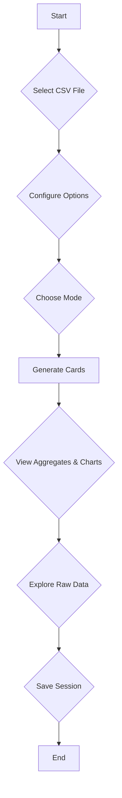

# CSV to Aggregates + Cards + Data Table

This is a powerful CSV analysis tool that allows you to upload a CSV file and automatically generate aggregates, charts, and a data table. It features both automatic and manual modes for data analysis, a variety of chart types, and a history system to save and load your analysis sessions.

## Features

- **CSV Parsing**: Upload CSV files and the application will automatically parse them. It supports auto-detection of delimiters and allows you to specify whether the first row contains headers.
- **Data Profiling**: The application profiles your data to infer column types (number, date, string) and roles (metric, dimension, ID).
- **Automatic Analysis**: In "Auto" mode, the application automatically generates up to 10 aggregates and charts based on the profiled data.
- **Manual Analysis**: In "Manual" mode, you can define your own column roles and create custom aggregates.
- **Interactive Charts**: The application uses Chart.js to generate a variety of interactive charts, including bar charts, line charts, pie charts, and more.
- **Data Table**: View the raw data in a searchable and sortable table with pagination.
- **History**: Save your analysis sessions and load them later. The history is stored in your browser's IndexedDB.
- **AI Workflow**: The application includes an AI-powered workflow that can automatically generate an analysis plan and provide explanations for the generated charts.

## How to Use

1.  **Select a CSV File**: Click the "Select CSV File" button to upload your CSV file.
2.  **Configure Options**: Set the delimiter, header, and date format options as needed.
3.  **Choose a Mode**:
    *   **Auto**: The application will automatically analyze your data and generate aggregates and charts.
    *   **Manual**: You can define column roles and create custom aggregates.
4.  **Generate Cards**: Click the "Generate Cards" button to create the aggregates and charts.
5.  **Interact with the Data**:
    *   View the aggregates and charts in the "Aggregates" section.
    *   Explore the raw data in the "Raw Data" table.
    *   Save your session using the "Save as New" button.
    *   Load previous sessions from the history sidebar.

## Workflow

## Technologies Used

- **HTML5**
- **CSS3**
- **JavaScript (ESM)**
- **Chart.js**: For data visualization.
- **PapaParse**: For CSV parsing.
- **Marked.js**: For rendering Markdown content.
- **IndexedDB**: For client-side storage of history.