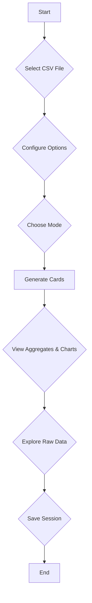

# AI-Powered CSV Analysis and Visualization Tool

This is a powerful, client-side CSV analysis tool that allows you to upload a CSV file and automatically generate aggregates, charts, and a data table. It features both automatic and manual modes for data analysis, a variety of chart types, and a history system to save and load your analysis sessions. The application is designed with a modular architecture and leverages AI to provide intelligent insights and streamline the data analysis process.

## Core Features

-   **Advanced CSV Parsing**: Upload CSV files with automatic delimiter detection. The application uses a web worker for parsing to ensure the UI remains responsive, even with large files.
-   **Intelligent Data Profiling**: The application profiles your data to infer column types (number, date, string) and roles (metric, dimension, ID), with specialized logic for ERP data patterns.
-   **AI-Powered Analysis**: In "Auto" mode, the application uses an AI-driven workflow to generate up to 10 aggregates and charts, complete with natural language explanations.
-   **Interactive Visualizations**: The application uses **Chart.js** to generate a variety of interactive charts, including bar charts, line charts, pie charts, and more.
-   **Comprehensive Data Table**: View the raw data in a searchable and sortable table with pagination and the ability to download filtered data.
-   **Persistent History**: Save your analysis sessions and load them later. The history is stored in your browser's **IndexedDB**, ensuring that your work is preserved across sessions.

## Architecture and Key Concepts

The application is built with a modular architecture that promotes separation of concerns and maintainability. The core logic is organized into several key modules:

-   **`ai_chart_store.js`**: Manages client-side storage using IndexedDB for session history and chunked CSV data, ensuring data persistence.
-   **`ai_chart_api.js`**: Handles communication with the Gemini API, featuring a `fetchWithRetry` function with exponential backoff to manage rate limits.
-   **`ai_chart_profile.js`**: Contains the logic for data profiling, including `inferType` and `inferRole` functions that automatically analyze and categorize columns.
-   **`ai_chart_task_manager.js`**: Manages the state of the AI analysis workflow, tracking tasks from initialization to completion and updating the UI accordingly.
-   **`ai_chart_erp_logic.js`**: Provides specialized logic for identifying and analyzing ERP data patterns, enabling more accurate and relevant insights for business data.

## AI-Powered Workflow

The application's AI workflow is designed to automate the data analysis process and provide users with actionable insights. Here's how it works:

1.  **Analysis Plan Generation**: When you upload a CSV file, the application sends the data profile to the Gemini API, which generates a customized analysis plan.
2.  **Task Management**: The `AITaskManager` class tracks the execution of the analysis plan, updating the UI with the current status of each task.
3.  **Chart Explanations**: For each chart generated, the application sends the aggregated data to the Gemini API to produce a natural language explanation of the findings.
4.  **Final Summary**: Once all charts and explanations are generated, the application creates a final summary of the entire analysis.

## How to Use

1.  **Select a CSV File**: Click the "Select CSV File" button to upload your CSV file.
2.  **Configure Options**: Set the delimiter, header, and date format options as needed.
3.  **Choose a Mode**:
    *   **Auto**: The application will automatically analyze your data and generate aggregates and charts.
    *   **Manual**: You can define column roles and create custom aggregates.
4.  **Generate Cards**: Click the "Generate Cards" button to create the aggregates and charts.
5.  **Interact with the Data**:
    *   View the aggregates and charts in the "Aggregates" section.
    *   Explore the raw data in the "Raw Data" table.
    *   Save your session using the "Save as New" button.
    *   Load previous sessions from the history sidebar.

## Workflow Diagram

## Technologies Used

-   **HTML5**
-   **CSS3**
-   **JavaScript (ESM)**
-   **Chart.js**: For data visualization.
- **PapaParse**: For CSV parsing.
- **Marked.js**: For rendering Markdown content.
- **IndexedDB**: For client-side storage of history.

## Business Use and Licensing

This project is well-suited for business applications, particularly for internal data analysis and reporting. The client-side architecture ensures that all data remains on the user's machine, providing a secure environment for sensitive information.

All third-party libraries used in this project are released under the **MIT License**, which is a permissive open-source license that allows for:

-   **Commercial Use**: You can use this application in a commercial product.
-   **Modification**: You can modify the source code to fit your needs.
-   **Distribution**: You can distribute the original or modified versions of the application.
-   **Private Use**: You are free to use the application for private purposes.

This makes the project a safe and flexible choice for business use without any licensing restrictions.