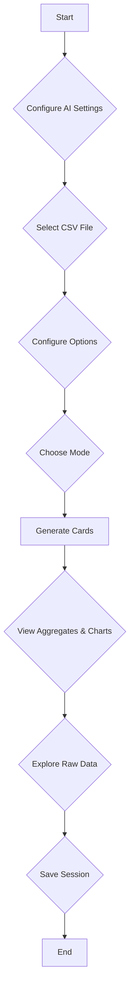

# AI-Powered CSV Analysis and Visualization Tool

This is a powerful, client-side CSV analysis tool that allows you to upload a CSV file and automatically generate aggregates, charts, and a data table. It features both automatic and manual modes for data analysis, a variety of chart types, and a history system to save and load your analysis sessions. The application is designed with a modular architecture and leverages AI to provide intelligent insights and streamline the data analysis process.

## Core Features

-   **Advanced CSV Parsing**: Upload CSV files with automatic delimiter detection. The application uses a web worker for parsing to ensure the UI remains responsive, even with large files.
-   **Intelligent Data Profiling**: The application profiles your data to infer column types (number, date, string) and roles (metric, dimension, ID), with specialized logic for ERP data patterns.
-   **AI-Powered Analysis**: In "Auto" mode, the application uses an AI-driven workflow to generate up to 10 aggregates and charts, complete with natural language explanations.
-   **Multi-Language Support**: Select from 20 languages for the AI's responses, making the analysis accessible to a global audience.
-   **Interactive Visualizations**: The application uses **Chart.js** to generate a variety of interactive charts, including bar charts, line charts, pie charts, and more.
-   **Comprehensive Data Table**: View the raw data in a searchable and sortable table with pagination and the ability to download filtered data.
-   **Persistent History**: Save your analysis sessions and load them later. The history is stored in your browser's **IndexedDB**, ensuring that your work is preserved across sessions.

## Developer Guide — Technical Deep Dive

This section explains the project architecture, data flow, and practical implementation details for developers (junior → senior). It includes quick-start tips, file responsibilities, extension points, and debugging/testing suggestions.

### Quick Start (dev)
- Open the project in your editor and serve a static host (for local file access use a simple server):
  - Example: python -m http.server 8000 (from project root).
- Open the app in a modern browser (Chrome/Edge/Safari). Use DevTools for logging and performance profiling.
- Key files to inspect first:
  - [`index.html`](index.html:1) — main UI skeleton and modal markup.
  - [`ai_chart_api.js`](ai_chart_api.js:1) — AI request logic and retry/backoff.
  - [`ai_chart_ai_settings_handlers.js`](ai_chart_ai_settings_handlers.js:1) — settings UI and localStorage integration.

### Core Architectural Principles (concise)
- Client-side processing: parsing, profiling, aggregation and rendering all run in-browser for privacy and simplicity.
- Modular ESM code: functionality is split into focused modules to keep surface area small and testable.
- Async-first design: file I/O, worker comms, IndexedDB, and network calls use async/await.
- Web worker for parsing: CSV parsing occurs in a worker to avoid UI jank.

### High-Level Data Flow (steps + code pointers)
1. File upload → parsing
   - UI: [`index.html`](index.html:1) file input triggers handler in `main.js`.
   - Worker: `csv_worker.js` (uses PapaParse) streams rows back to main thread.
   - Storage: parsed rows are written to IndexedDB via [`ai_chart_store.js`](ai_chart_store.js:1).

2. Profiling → plan generation
   - Profiling: [`ai_chart_profile.js`](ai_chart_profile.js:1) inspects columns (functions: `inferType`, `inferRole`).
   - AI call: [`ai_chart_api.js`](ai_chart_api.js:1) sends a prompt containing the profile; receives an "analysis plan" JSON.

3. Task execution → charts + explanations
   - Task manager: [`ai_chart_task_manager.js`](ai_chart_task_manager.js:1) acts as a lightweight state machine to run the plan sequentially.
   - Aggregations: core aggregation helpers live near the task manager (look for `aggregate`/`groupBy` helpers).
   - Visualization: charts rendered with Chart.js; explanations rendered using Marked.js.

4. UI / persistence
   - UI handlers: [`ai_chart_ui_handlers.js`](ai_chart_ui_handlers.js:1) update DOM, create cards, and handle user interactions.
   - Session persistence: [`ai_chart_store.js`](ai_chart_store.js:1) saves sessions and chunked CSV to IndexedDB.

### File Responsibility Reference
- [`index.html`](index.html:1) — UI layout, modals, and static assets.
- [`main.js`](main.js:1) — app bootstrap, wiring events to modules.
- [`csv_worker.js`](csv_worker.js:1) — background CSV parsing (PapaParse).
- [`ai_chart_store.js`](ai_chart_store.js:1) — IndexedDB abstraction (save/load sessions).
- [`ai_chart_profile.js`](ai_chart_profile.js:1) — data profiling heuristics.
- [`ai_chart_erp_logic.js`](ai_chart_erp_logic.js:1) — ERP-specific heuristics (optional).
- [`ai_chart_api.js`](ai_chart_api.js:1) — Gemini API prompt construction, `fetchWithRetry`.
- [`ai_chart_task_manager.js`](ai_chart_task_manager.js:1) — orchestrates plan execution.
- [`ai_chart_ui_handlers.js`](ai_chart_ui_handlers.js:1) — DOM updates, chart rendering.
- [`ai_chart_ai_settings_handlers.js`](ai_chart_ai_settings_handlers.js:1) — settings modal, localStorage keys: `gemini_api_key`, `gemini_model`, `ai_language`.

### Extension Points & Typical Changes
- Adding models or instruction templates:
  - Edit [`ai_chart_api.js`](ai_chart_api.js:1): centralize prompt templates and language injection.
- Custom aggregation logic:
  - Add helpers alongside `ai_chart_task_manager.js` and update the plan-to-aggregation mapping.
- New chart types:
  - Update `ai_chart_ui_handlers.js` rendering paths and Chart.js config templates.

### Debugging & Performance Tips
- CPU-heavy work? Profile and move to worker. Use Chrome's Performance tab to find main-thread spikes.
- Inspect network calls to Gemini in DevTools — watch for rate-limit responses; `fetchWithRetry` handles retries but log responses for debugging.
- IndexedDB errors: wrap calls with try/catch and enable verbose logging inside [`ai_chart_store.js`](ai_chart_store.js:1).

### Testing & Validation
- Manual tests:
  - Use small and large CSV samples to validate streaming parsing and UI responsiveness.
  - Create edge-case CSVs (missing headers, mixed types) to verify `inferType`/`inferRole`.
- Unit / smoke tests:
  - Modules are plain JS — extract pure functions (profiling, aggregation) and test with Jest or similar.
- Integration tests:
  - Run the app in a headless browser (Puppeteer) to exercise the UI flows end-to-end.

### Security & Privacy Notes
- All processing is client-side; the only external dependency is the Gemini API request (requires a user-provided API key).
- Do not commit API keys. Keys are stored in `localStorage` by design — document this to users and teams.

### Recommended Onboarding Steps for New Contributors
1. Run the app locally and open DevTools.
2. Trace a full flow: upload CSV → profile → generate cards. Observe logs.
3. Inspect the prompt sent to Gemini in [`ai_chart_api.js`](ai_chart_api.js:1) to understand how the AI plan is requested.
4. Modify a small module (e.g., add a logging statement in [`ai_chart_profile.js`](ai_chart_profile.js:1)) and test.

### Summary
This project is intentionally modular and approachable. For quick contributions: focus on small, well-scoped changes (profiling heuristics, chart templates, or small UI improvements). For larger features, update the plan generation or task execution layers, and add unit tests for pure logic.

## How to Use

1.  **Configure AI Settings**: Click the robot icon (🤖) in the sidebar to open the AI Settings modal. Enter your Gemini API key, select a model, and choose a response language.
2.  **Select a CSV File**: Click the "Select CSV File" button to upload your CSV file.
3.  **Configure Options**: Set the delimiter, header, and date format options as needed.
4.  **Choose a Mode**:
    *   **Auto**: The application will automatically analyze your data and generate aggregates and charts.
    *   **Manual**: You can define column roles and create custom aggregates.
5.  **Generate Cards**: Click the "Generate Cards" button to create the aggregates and charts.
6.  **Interact with the Data**:
    *   View the aggregates and charts in the "Aggregates" section.
    *   Explore the raw data in the "Raw Data" table.
    *   Save your session using the "Save as New" button.
    *   Load previous sessions from the history sidebar.

## Workflow Diagram

## Technologies Used

-   **HTML5**
-   **CSS3**
-   **JavaScript (ESM)**
-   **Chart.js**: For data visualization.
- **PapaParse**: For CSV parsing.
- **Marked.js**: For rendering Markdown content.
- **IndexedDB**: For client-side storage of history.

## Business Use and Licensing

This project is a powerful, client-side tool ideal for business intelligence, data analysis, and reporting. Its modular design and AI capabilities make it a valuable asset for any organization looking to derive insights from their data.

### Business Applications

-   **Internal Data Analysis**: Empower your teams to analyze sales data, marketing campaigns, and operational metrics without the need for complex software.
-   **Client Reporting**: Quickly generate and share insightful reports with clients, complete with charts and AI-generated explanations.
-   **Prototyping and Demos**: Use the tool to prototype data-driven features or demonstrate the power of AI in data analysis.

### Licensing

This project is built using open-source libraries, all of which are under the **MIT License**. This permissive license allows for:

-   **Commercial Use**: You can use, modify, and distribute this application for commercial purposes without any fees or royalties.
-   **Private Use**: You are free to use and modify the application for your own purposes.
-   **Distribution**: You can distribute the original or modified versions of the application, as long as you include the original copyright and license notice.

This makes the project a safe and flexible choice for business use, with no restrictive licensing to worry about.