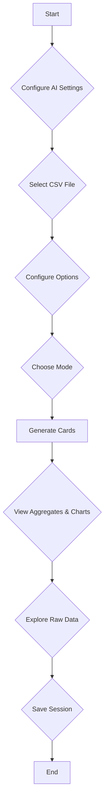

# AI-Powered CSV Analysis and Visualization Tool

This is a powerful, client-side CSV analysis tool that allows you to upload a CSV file and automatically generate aggregates, charts, and a data table. It features both automatic and manual modes for data analysis, a variety of chart types, and a history system to save and load your analysis sessions. The application is designed with a modular architecture and leverages AI to provide intelligent insights and streamline the data analysis process.

## Core Features

-   **Advanced CSV Parsing**: Upload CSV files with automatic delimiter detection. The application uses a web worker for parsing to ensure the UI remains responsive, even with large files.
-   **Intelligent Data Profiling**: The application profiles your data to infer column types (number, date, string) and roles (metric, dimension, ID), with specialized logic for ERP data patterns.
-   **AI-Powered Analysis**: In "Auto" mode, the application uses an AI-driven workflow to generate up to 10 aggregates and charts, complete with natural language explanations.
-   **Multi-Language Support**: Select from 20 languages for the AI's responses, making the analysis accessible to a global audience.
-   **Interactive Visualizations**: The application uses **Chart.js** to generate a variety of interactive charts, including bar charts, line charts, pie charts, and more.
-   **Comprehensive Data Table**: View the raw data in a searchable and sortable table with pagination and the ability to download filtered data.
-   **Persistent History**: Save your analysis sessions and load them later. The history is stored in your browser's **IndexedDB**, ensuring that your work is preserved across sessions.

## Technical Deep Dive for Developers

This section provides a more detailed look at the project's architecture, data flow, and key technical decisions, intended for developers who want to understand, contribute to, or extend the application.

### Core Architectural Principles

-   **Client-Side Processing**: All data processing, including CSV parsing and analysis, is done in the browser. This enhances data privacy and reduces server-side load.
-   **Modularity (ESM)**: The codebase is organized into JavaScript modules (`.js` files with `import`/`export`) to promote separation of concerns, making the code easier to maintain and debug.
-   **Asynchronous Operations**: The application makes extensive use of `async/await` for non-blocking operations like file reading, API calls, and IndexedDB transactions, ensuring a responsive UI.
-   **Web Workers**: CSV parsing is offloaded to a web worker (`csv_worker.js`) to prevent the main thread from freezing, especially with large files.

### Data Flow and State Management

The application follows a clear data flow from file upload to visualization:

1.  **File Upload & Parsing**:
    -   The user selects a CSV file via the `<input type="file">` element.
    -   `main.js` listens for the `change` event and sends the file to `csv_worker.js` for parsing with **PapaParse**.
    -   The worker streams the parsed data back to the main thread, where it is stored in **IndexedDB** for persistence.

2.  **Data Profiling**:
    -   Once parsing is complete, `ai_chart_profile.js` is invoked.
    -   The `profileData` function iterates through the columns, using `inferType` and `inferRole` to determine the data type (e.g., `number`, `date`) and business role (e.g., `metric`, `dimension`).
    -   This profile is crucial for the AI to understand the data's structure.

3.  **AI-Powered Analysis (Auto Mode)**:
    -   The data profile is sent to the Gemini API via `ai_chart_api.js`.
    -   The AI returns an "analysis plan," which is a JSON object containing a list of aggregations and chart specifications.
    -   The `AITaskManager` in `ai_chart_task_manager.js` takes this plan and executes each task sequentially.
    -   For each chart, it sends the aggregated data back to the AI to generate a natural language explanation.

4.  **Rendering**:
    -   Aggregates and charts are rendered dynamically using **Chart.js**.
    -   The raw data is displayed in a paginated table with search and sort functionality.
    -   AI-generated explanations are rendered as Markdown using **Marked.js**.

### Key Modules and Their Responsibilities

-   **`main.js`**: The entry point of the application. It initializes event listeners for UI elements and orchestrates the overall workflow.
-   **`ai_chart_store.js`**: A robust data layer that abstracts IndexedDB operations. It handles saving/loading session history and managing chunked CSV data, providing a simple promise-based API for the rest of the application.
-   **`ai_chart_api.js`**: Manages all communication with the Gemini API. It includes a `fetchWithRetry` function with exponential backoff, which is a critical feature for handling API rate limits gracefully.
-   **`ai_chart_profile.js`**: Contains the data profiling logic. The `inferType` and `inferRole` functions use a combination of regex and heuristics to analyze column data. It also includes specialized logic for ERP data patterns in `ai_chart_erp_logic.js`.
-   **`ai_chart_task_manager.js`**: A state machine for the AI analysis workflow. It tracks the progress of each task (e.g., "generating plan," "creating chart") and updates the UI accordingly, providing real-time feedback to the user.
-   **`ai_chart_ui_handlers.js`**: Manages UI interactions, such as rendering charts, updating tables, and handling user inputs.
-   **`ai_chart_ai_settings_handlers.js`**: Encapsulates the logic for the AI settings modal, including saving the API key, model, and language preference to `localStorage`.

## How to Use

1.  **Configure AI Settings**: Click the robot icon (🤖) in the sidebar to open the AI Settings modal. Enter your Gemini API key, select a model, and choose a response language.
2.  **Select a CSV File**: Click the "Select CSV File" button to upload your CSV file.
3.  **Configure Options**: Set the delimiter, header, and date format options as needed.
4.  **Choose a Mode**:
    *   **Auto**: The application will automatically analyze your data and generate aggregates and charts.
    *   **Manual**: You can define column roles and create custom aggregates.
5.  **Generate Cards**: Click the "Generate Cards" button to create the aggregates and charts.
6.  **Interact with the Data**:
    *   View the aggregates and charts in the "Aggregates" section.
    *   Explore the raw data in the "Raw Data" table.
    *   Save your session using the "Save as New" button.
    *   Load previous sessions from the history sidebar.

## Workflow Diagram

## Technologies Used

-   **HTML5**
-   **CSS3**
-   **JavaScript (ESM)**
-   **Chart.js**: For data visualization.
- **PapaParse**: For CSV parsing.
- **Marked.js**: For rendering Markdown content.
- **IndexedDB**: For client-side storage of history.

## Business Use and Licensing

This project is a powerful, client-side tool ideal for business intelligence, data analysis, and reporting. Its modular design and AI capabilities make it a valuable asset for any organization looking to derive insights from their data.

### Business Applications

-   **Internal Data Analysis**: Empower your teams to analyze sales data, marketing campaigns, and operational metrics without the need for complex software.
-   **Client Reporting**: Quickly generate and share insightful reports with clients, complete with charts and AI-generated explanations.
-   **Prototyping and Demos**: Use the tool to prototype data-driven features or demonstrate the power of AI in data analysis.

### Licensing

This project is built using open-source libraries, all of which are under the **MIT License**. This permissive license allows for:

-   **Commercial Use**: You can use, modify, and distribute this application for commercial purposes without any fees or royalties.
-   **Private Use**: You are free to use and modify the application for your own purposes.
-   **Distribution**: You can distribute the original or modified versions of the application, as long as you include the original copyright and license notice.

This makes the project a safe and flexible choice for business use, with no restrictive licensing to worry about.